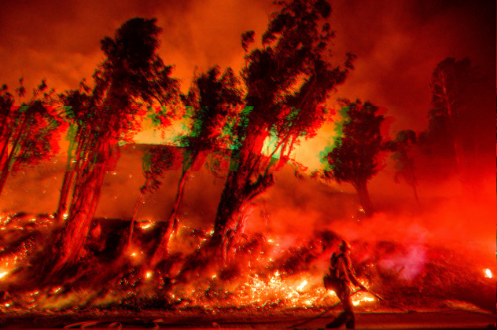

# Kaggle-Disaster-Tweet-Classification-with-BERT

This is my notebook for submission to Kaggle's [Real or Not? NLP with Disaster Tweets](https://www.kaggle.com/c/nlp-getting-started) Competition, 
where the task was to predict which tweets are about real disasters and which are not.
I scored accuracy of **84.002%**, at 163/1851 ranking (top 8.8%).

I used BERT model ([paper](https://arxiv.org/pdf/1810.04805.pdf)) 
(from Huggingface's [transformers](https://huggingface.co/transformers/v2.2.0/model_doc/bert.html#bertforsequenceclassification) library) because:

many words can contain different meanings depending its context. For example (taken from Kaggle dataset for this competition), 

* smoke from #wildfires pours into a school  (disaster tweet)
* smoke good eat drink drive nice car wear all green mink  (non-disaster tweet)

the word *smoke* in the two sentences above have totally different meanings.
BERT is good at catching word's such **context** in a sentence, which is not a forte for traditional Word2Vec vectors. 
